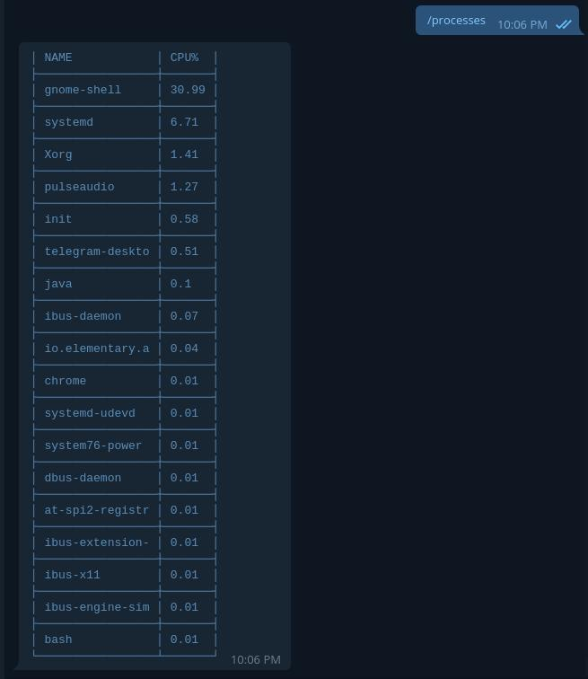
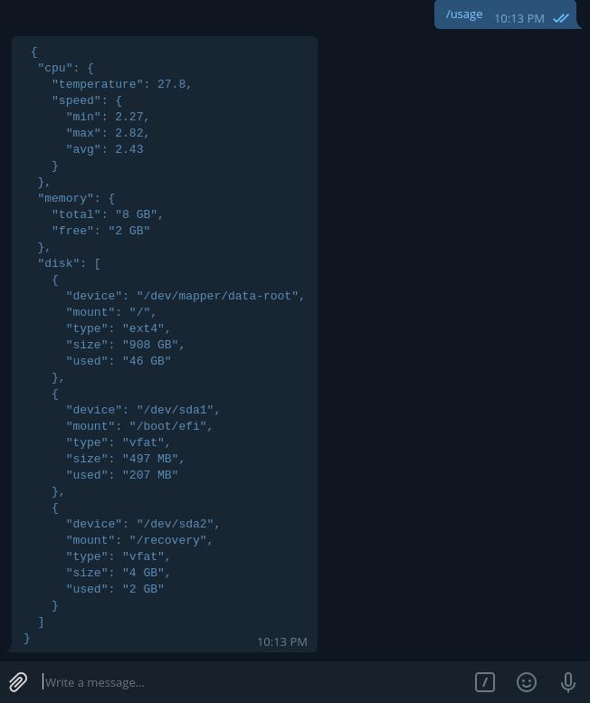
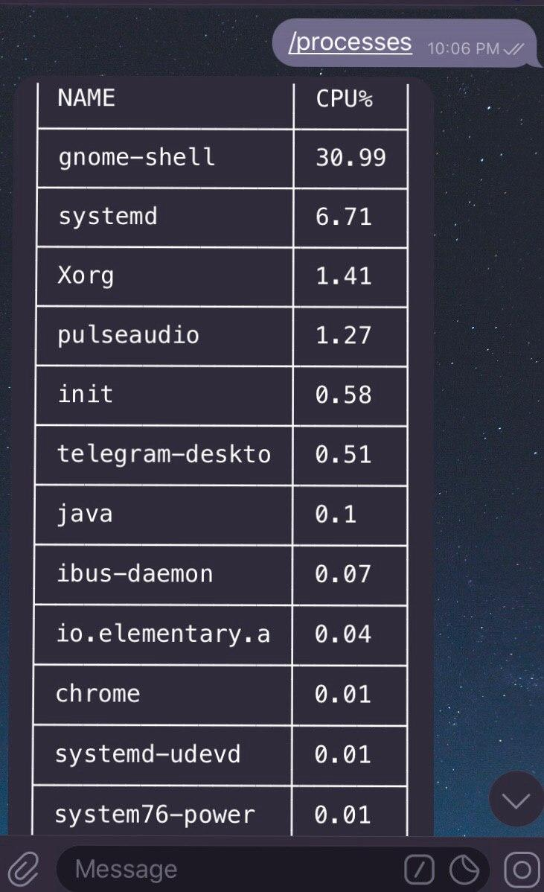

# **Telegram server monitor**

**Monitor your server using Telegram's Bot API**



## Installation:
Clone the repository, ```cd``` into it and run :
```shell script
 npm install
```

## Getting started:
Rename ```.env.example``` to ```.env```

Replace ```BOT_TOKEN``` value to your bot token. For security reasons there is the ```ALLOWED_IDENTIFIERS``` 
variable. You need to get your ID from the bot. Run the command ```npm run bot``` or ```node index``` to start the bot
and use the command ``/my_id``  to output your ID. Replace the existing 
```ALLOWED_IDENTIFIERS``` with your own ID **(you can use multiple if you have multiple accounts, just list them with a coma)**;
